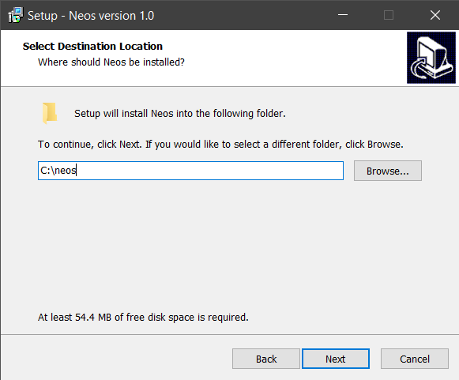
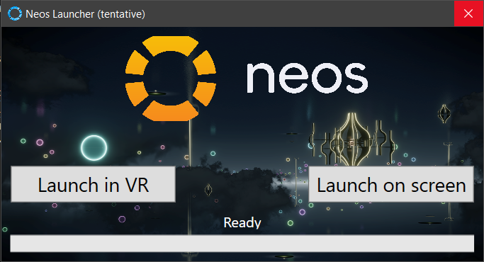
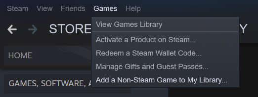
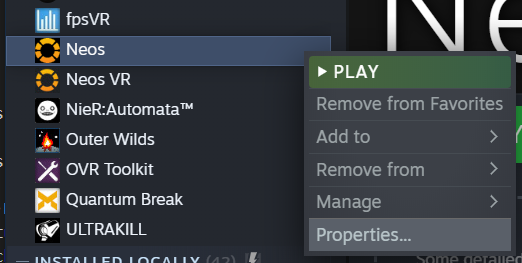
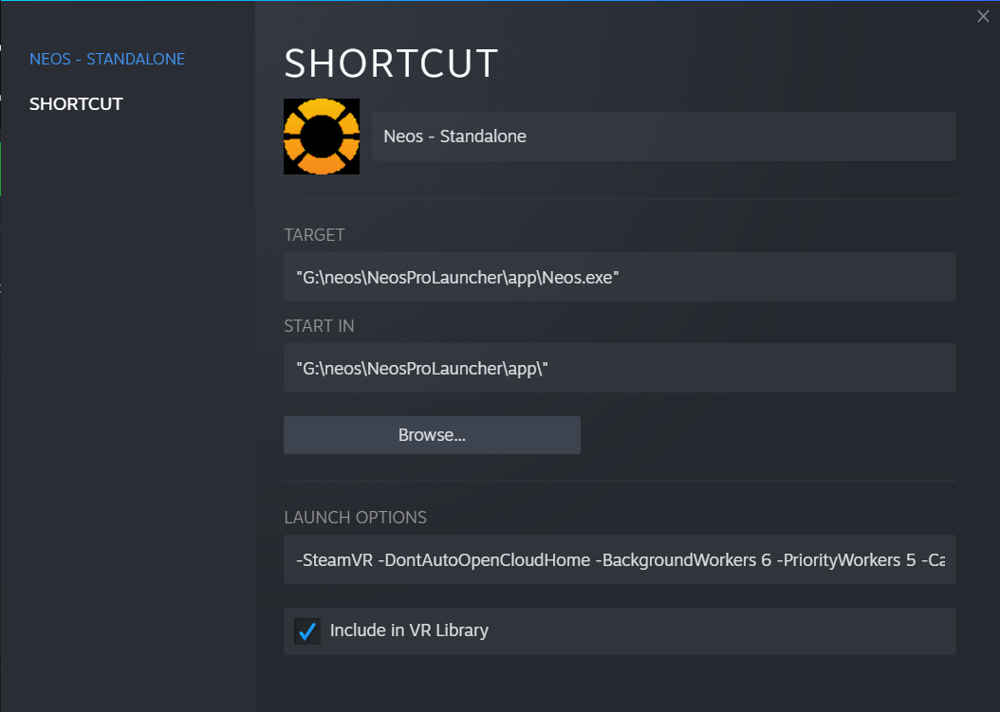

# Neos Standalone Setup

How to have steam hour logging, mods, and NCR simultaneously

## Explanation

If you don't care about why we're doing things and just want the steps, skip to the [setup](#setup) section.

First, lets about how Neos is shipped. Both the Steam and standalone versions come with a launcher. This is called NeosLauncher.exe. This is *only* a helper program that launches Neos with extra [command line arguments](https://wiki.neos.com/Command_Line_Arguments). You do not need to launch Neos via NeosLauncher.exe if you have a different way of passing in arguments, for example via Steam's launch options. Next, Neos standalone also comes with a special NeosProLauncher.exe. This application updates the standalone install when opened and can launch Neos, but notably **it cannot pass command line arguments**. This means while we need it for updating, we cannot launch modded Neos using it.

Finally, lets talk Steam integration. As long as Steam is running *before* Neos starts, Neos will hook up with Steam. This enables Steam playtime logging and Steam networking. You do not actually need to launch via Steam, however launching via Steam will guarantee you don't forget to open your Steam client.

So to summarize:

Neos.exe is the actual game. We need to pass special command line arguments to this. There are three commonly used launchers:

| Launcher            | Can update Neos?        | Can pass command line arguments? |
| ------------------- | ----------------------- | -------------------------------- |
| NeosLauncher.exe    | No                      | Yes                              |
| Steam               | Steam version only      | Yes                              |
| NeosProLauncher.exe | Standalone version only | No                               |

Therefore, my suggestion is you use NeosProLauncher to keep your install updated and a non-Steam game shortcut within steam to actually launch Neos.

## Setup

1. Grab and run [NeosPublicSetup.exe](https://assets.neos.com/install/NeosPublicSetup.exe)
2. Install it wherever you want to. The default `C:\Neos` location is fine if you don't have multiple drives to worry about. If you do, check the [drive notes](directories.md/#drive-notes). **Do not merge your standalone install into your Steam install!** While merging installs can technically work it can easily create more problems than it solves.  
   
3. Go to the directory you installed to and run `NeosProLauncher.exe`. Wait for it to finish patching. **Do not use either of the launch buttons!** We're only using this to update Neos, not launch it.  
   
4. Once the pro launcher says it's ready, simply exit it without launching.
5. Observe that an `app` directory has been created next to `NeosProLauncher.exe`. So, for example, it may be in `C:\Neos\app`. This `app` directory contains the standalone neos install, and contains the `NeosLauncher.exe` and `Neos.exe` that you are familiar with from the Steam install.
6. Go to steam and add a non-steam game.  
   
7. Hit the "browse" button, and go to `C:\Neos\app\Neos.exe` (or wherever is applicable given your install directory)
8. Hit the "add selected programs" button.
9. Right click the newly added game in your library, and go to "properties"  
   
10. Configure the non-steam game with the same launch options you would use on the Steam version (`-LoadAssembly Libraries\NeosModLoader.dll`). Optionally, give it a more descriptive name and check the "Include in VR Library" checkbox.  
      
11. Install NeosModLoader into the standalone version [as you normally would for the steam version](../README.md#installation), but using your `C:\Neos\app` directory instead.
12. Launch Neos using your new non-steam game shortcut. Steam will track playtime on the Steam version of the game even though you are running the standalone version.

## Important Notes

- You will need to run `NeosProLauncher.exe` every time you want to update. You never need actually use its launch buttons, as it does not support launch options which are required for plugins/mods.
- The logs you're used to finding in `C:\Program Files (x86)\Steam\steamapps\common\NeosVR\Logs` will go to `C:\Neos\app\Logs` now.
