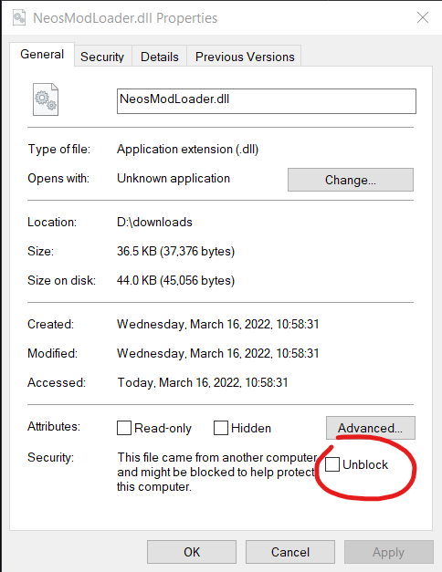

# Troubleshooting NeosModLoader

Below we will go over some common problems and their solutions.

## NeosModLoader Isn't Being Loaded

**Symptoms:**

- After starting the game nothing has changed, and it appears completely unmodified.
- Logs don't say anything about "NeosModLoader"

**Fix:**

If the problem is the `-LoadAssembly` setup:

1. Check the logs (`C:\Program Files (x86)\Steam\steamapps\common\NeosVR\Logs`). If you search the log for "NeosModLoader" you should find a section that looks like this:

   ```log
   5:26:23 PM.305 (  0 FPS)    Argument: Neos.exe
   5:26:23 PM.305 (  0 FPS)    Argument: -LoadAssembly
   5:26:23 PM.305 (  0 FPS)    Argument: Libraries\NeosModLoader.dll
   ```

   If those logs are absent it indicates you are not passing the `-LoadAssembly Libraries\NeosModLoader.dll` argument to Neos correctly.
2. Double check your shortcut to Neos.
3. Check a known-working shortcut.
   1. Navigate to the Neos install directory. (`C:\Program Files (x86)\Steam\steamapps\common\NeosVR`)
   2. Create a new text file named `start_neos.bat` in your Neos install directory. Make sure the file extension is `.bat` and not`.txt`.
   3. Copy the contents of the example [start_neos.bat](start_neos.bat) into yours.
   4. Run your `start_neos.bat` by double-clicking it in your file explorer.
   5. Neos should start and load NeosModLoader as expected.

If the problem is the FrooxEngine.dll path on Linux:

1. If you are on Linux, make sure you've followed the [extra Linux instructions](linux.md).

If the problem is Windows blocking the DLL file:

1. Right click on the NeosModLoader.dll file and open the properties.
2. Check the unblock checkbox, and hit OK.  
   
3. Repeat this process for 0Harmony.dll.

If the problem is your antivirus:

1. Make sure your antivirus has not quarantined or deleted NeosModLoader.dll or 0Harmony.dll.
2. Add an exception to your antivirus. If you're uncomfortable adding an exception, you have options:
   - Don't run NeosModLoader.
   - Change to an antivirus that has fewer false positives.
   - Build NeosModLoader and/or Harmony yourself from source code.

## NeosModLoader Loads, but Errors Out

**Symptoms:**

- Mods are not loading
- All of your contacts have a magenta border and appear to be using an incompatible version

**Fix:**

1. Verify that the [installation instructions](../README.md#installation) were followed correctly
2. If you are using the [standalone](neos_standalone_setup.md) or [Linux](linux.md) builds, make sure you've followed the extra steps.
3. Check the logs (`C:\Program Files (x86)\Steam\steamapps\common\NeosVR\Logs`). There are a few things you are likely to find:

Possibility 1: Harmony is not installed correctly.

1. Your log contains the following:

   ```log
   18:36:34.158 (  0 FPS) [ERROR][NeosModLoader] Exception in execution hook!
   System.IO.FileNotFoundException: Could not load file or assembly '0Harmony, Version=2. 2.0.0, Culture=neutral, PublicKeyToken=null' or one of its dependencies.
   File name: '0Harmony, Version=2.2.0.0, Culture=neutral, PublicKeyToken=null'
   at NeosModLoader.ExecutionHook..cctor () [0x00000] in  <67d6a64d7ebf403f83f1a8b1d8c03d22>:0
   ```

2. Go back to the [installation instructions](../README.md#installation) and install Harmony to the correct location.

Possibility 2: You are using an old version of NeosModLoader.

1. Check your log for a line like this:

  ```log
  5:26:24 PM.823 (  0 FPS) [INFO] [NeosModLoader] NeosModLoader v1.8.0 starting up!
  ```

2. Verify your NeosModLoader version matches [the latest release](https://github.com/neos-modding-group/NeosModLoader/releases/latest).

Possibility 3: NeosModLoader itself is broken, even on the latest version. This can happen in rare circumstances when Neos updates.

1. Please report the issue on [our Discord][Neos Modding Discord] or in [a GitHub issue](https://github.com/neos-modding-group/NeosModLoader/issues).
2. Wait for a fix.

## Multiplayer Compatibility is Broken, but Everything Else Works

**Symptoms:**

- Mods are loading
- All of your contacts have a magenta border and appear to be using an incompatible version

**Fix:**

1. Make sure you are not running more than one plugin. For safety reasons, NeosModLoader will only spoof your version if it is the only plugin running.
2. If you absolutely need your other plugin and understand the risks there is a [configuration](modloader_config.md) available to force version spoofing.

## A Mod is Breaking Neos

**Symptoms:**

- Modded Neos is broken or crashing unexpectedly
- Unmodified Neos is working

**Fix:**

Remove the offending mod, and contact its developer so they can fix the bug.

If you are not sure which mod is broken, follow the below steps:

1. Check the logs (`C:\Program Files (x86)\Steam\steamapps\common\NeosVR\Logs`). They should indicate which mod is failing. If the logs don't help, then continue with the following steps.
2. Disable NeosModLoader by removing the `-LoadAssembly Libraries\NeosModLoader.dll` launch option. If Neos is still having problems while completely unmodified, you can get support on the [Neos Discord](https://discordapp.com/invite/GQ92NUu5). **You should not ask the Neos Discord for help with mods.**
3. If you only experience the problem while modded, try uninstalling all of your mods and re-installing them one by one. Once you find the problematic mod reach out it its developers.
4. If the issue appears to be with NeosModLoader itself, please open [an issue](https://github.com/neos-modding-group/NeosModLoader/issues).

## I Need More Help

If you are having trouble diagnosing the issue yourself, we have a #help-and-support channel in the [Neos Modding Discord]. The first thing we're likely to ask for is your log, so please have that handy. You can find logs here: `C:\Program Files (x86)\Steam\steamapps\common\NeosVR\Logs`

<!--- Link References -->
[Neos Modding Discord]: https://discord.gg/vCDJK9xyvm
